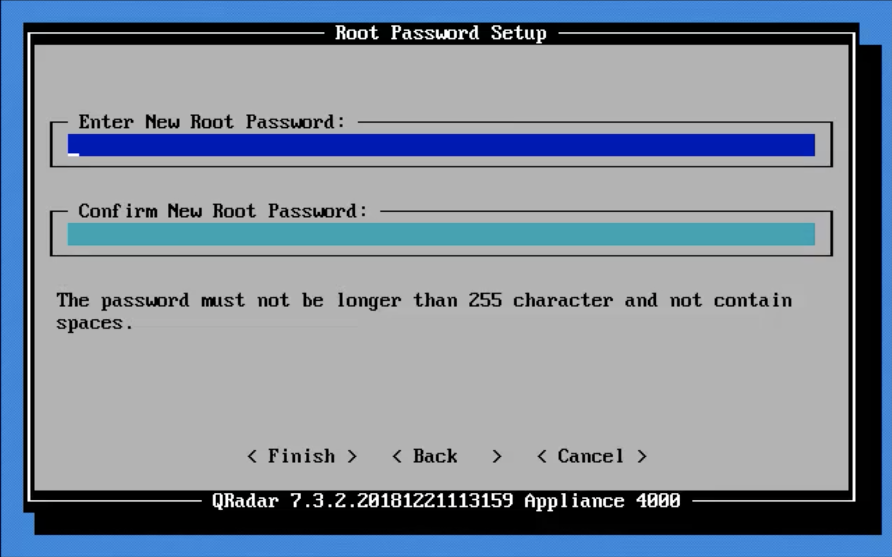

## **QRadar applications overview**

Applications enhance the QRadar system with new data and functionality.

The combined memory requirements of all the applications in an All-In-One(AIO) is 10% of the total `available memory`

### Content extension

-   Content extension : Add additional data in QRadar such as rules, searches , custom event properties(`CEPs`) and reference sets.

### **PostgreSQL database**

Applications are stored in a Postgres DB which resides on the console.

### **[Basic Application Troubleshooting](https://www.ibm.com/support/pages/qradar-basic-app-troubleshooting-opening-qradar-support-ticket-1#:~:text=Go%20to%20Admin%20%3E%20Extensions%20Management,%2Fstore%2Fqapp%20directory%20exists.&text=Reinstall%20the%20latest%20version%20of,your%20browser%20cache%20and%20cookies)**

> Each QRadar runs in its own docker container and has its own application logs seperate from QRadar logs.

Applications can run in an AIO appliance or in the case of a distributed architecture. A seperate managed host called an `App Node` can be deployed which is a dedicated host for running applications.

### **`Deploying an App Host`**

1.  Install an app host. The `ISO` that has been used to install the console can install the app host as well.
2.  Assign the app host as the appliance type.

    

3.  Assign by functionality.

   
4.  Specify the type of setup. If we are setting up high-availability pair then choose the second option.
5.  Select the time zone continent.
    5.1 Select time zone region.
6.  Set internet protocol settings .
7.  Management Interface.
8.  Network information.
9.  Enter the root password.
10. Wait for the installation to complete.The following is displayed when the installation is completed.

> QRadar is not aware of the app host after the installation. Therefore we need to add it to the deployment

### **`Adding the app host to the deployment`**

-   Navigate to `System and License Management`
-   Under Display switch to `Systems`
-   Locate `Deployment Actions` and click `Add Host`
-   Enter host information.
-   Wait for the host to be added. The newly added host should be visible in the table of hosts.
-   Perform a `deployment`
-   Migrate the applications to the app host.Click `Change to where apps are run`. The following window should appear.
-   Migration in progress.
-   Verify that the applications are running on the app host. Run `docker ps`. You should see something similar to the output below.

> `[root@app-host ~]# docker ps CONTAINER ID IMAGE COMMAND CREA NAMES 8e36dcc580a7 console.localdeployment:5000/qapp/1651:4.0.0-20210825194856 "sh /opt/app-root/bi…" 3 ho774->5000/tcp qapp-1701-UwRGJdpI 9f68f42358cc console.localdeployment:5000/qapp/1601:2.2.0-20210708134505 "sh /opt/app-root/bi…" 3 ho773->5000/tcp qapp-1651-v3hgTgRV 2befafa5f829 console.localdeployment:5000/qapp/1553:2.1.1-20210706234215 "sh /start_container…" 3 ho772->5000/tcp qapp-1603-90onWvnb 6f31e9131561 console.localdeployment:5000/qapp/1401:7.0.2-20210608115811 "sh /opt/app-root/bi…" 3 ho771->5000/tcp qapp-1451-BKPtZnAp 4f275fa0ae12 console.localdeployment:5000/qapp/1251:1.1.0-20210525000559 "sh /start_container…" 3 ho770->5000/tcp qapp-1301-E2DqKyUZ 843ca321dd2a console.localdeployment:5000/qapp/1102:3.2.0-20210825213427 "sh /opt/app-root/bi…" 4 ho769->5000/tcp qapp-1152-56O7flRs 34ef35188871 console.localdeployment:5000/qapp/1151:3.4.1-20210825214653 "sh /opt/app-root/bi…" 4 ho768->5000/tcp qapp-1201-0DQj30Oy [root@app-host ~]#`
